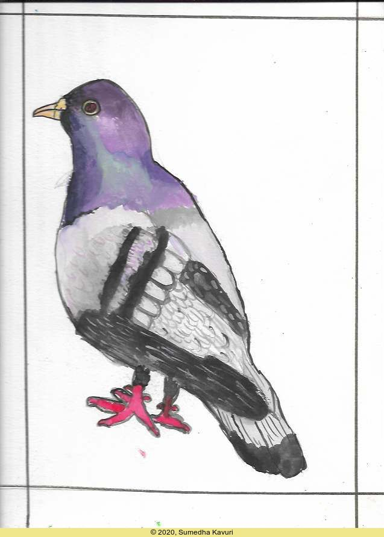
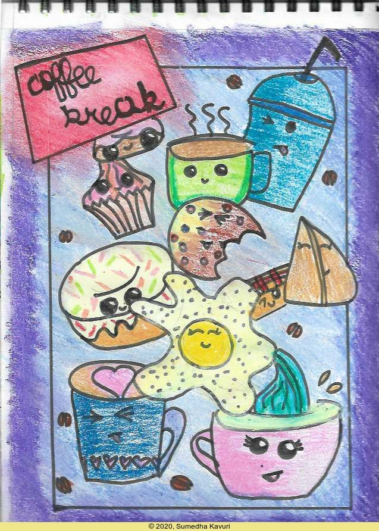
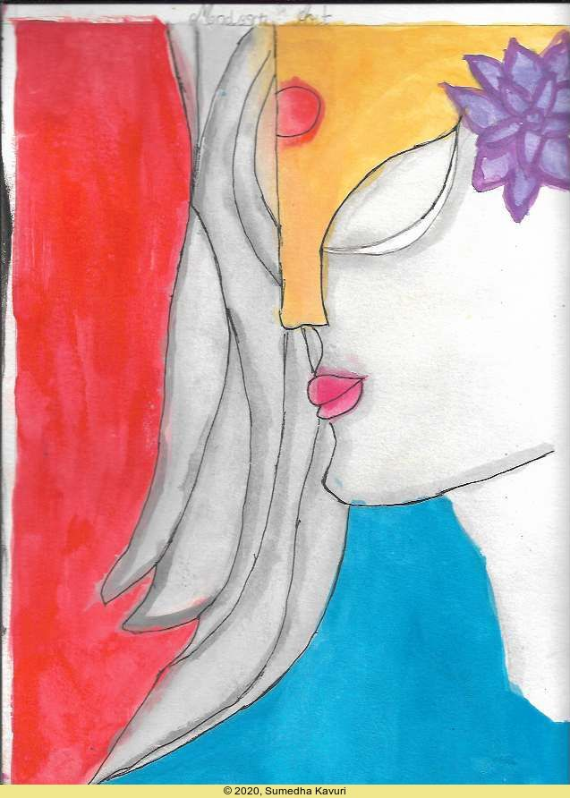

 Sumedha's Stuff

# Pigeon Hungama!

This is a pigeon, and this was one of my first water colour paintings. It looks pretty satisfying for a **first** shot I feel. The technique for the scruffy wings is to use a **thin** brush. And the bluish - green part of the pigeon's neck was made **accidentally** great. All this was also with the help of my **drawing teacher**, ***Roopa ma'am***. Hope you all like it!

# Coffee Break

This is another drawing of mine. In fact, it's a **doodle**! It really doesn't **only** have coffee but also other **"savouries"** like, donuts, muffins, omelette, etc. it also has **Coffee Beans**! The triangular savoury is called *samosa*, an Indian savoury. This is also with the help of my **drawing teacher**, ***Roopa ma'am***. Hope you all like it!

# Lady Modern Art

 

This is also another drawing of mine, **Lady Modern Art**. Well, it is called **Modern Art** because it made in different colours rather than the real world. For example, the lady is totally in grey colour. This is also with the help of my **drawing teacher**, ***Roopa ma'am***.

